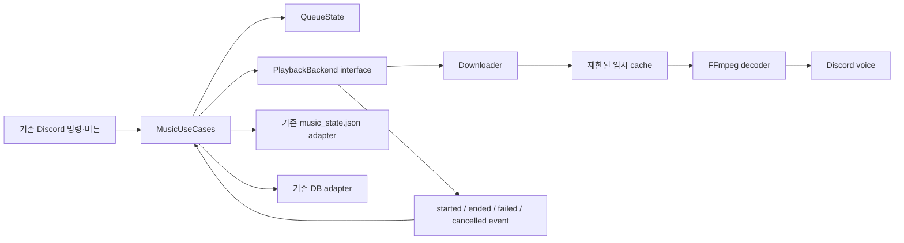

# 음악 엔진 재구축 판단과 계획

> 구현 상태: 0~3단계 완료. 기본 `download` backend를 Pi 임시 clone에서 전체 테스트와
> 실제 실패 곡 전체 다운로드·decode로 검증했습니다. 4단계의 기존 `direct` backend
> 제거는 하루 이상 실제 운영 안정화 뒤에만 진행합니다.

## 1. 결론

저장소 전체를 지우고 모든 기능을 처음부터 다시 만드는 것은 권장하지 않습니다.
현재 문제는 대기열·UI·DB·재시작 복원 전체가 아니라 실제 오디오를 가져오는 마지막
경계에 집중되어 있습니다. 검증된 외부 동작을 그대로 둔 채 음악 재생 엔진만 교체할
수 있도록 분리하는 편이 위험과 작업량이 훨씬 작고, 기존 봇으로 즉시 되돌아갈 수도
있습니다.

권장 목표는 다음과 같습니다.

> Discord 명령·대시보드·대기열·데이터 형식은 유지하고, YouTube 입력을 안정적인
> 오디오 프레임으로 바꾸는 `PlaybackBackend`만 새로 작성한다.

## 2. 왜 친구 봇은 될 수 있는가

“6개월 동안 업데이트하지 않았다”는 사실만으로 두 봇이 같은 경로를 쓴다는 뜻은
아닙니다. 아래 중 하나만 달라도 같은 곡의 결과가 달라질 수 있습니다.

| 차이 | 친구 봇이 영향을 덜 받을 수 있는 이유 | 확인 방법 |
| --- | --- | --- |
| 재생 엔진 | Lavalink, 로컬 다운로드, 다른 downloader는 FFmpeg가 CDN URL을 직접 열지 않을 수 있음 | 사용 패키지와 프로세스 구조 확인 |
| YouTube client/format | web, android, ios, mweb 등이 서로 다른 URL·format·인증 요구를 받을 수 있음 | 실제 extractor options와 format ID 비교 |
| 실행 위치/IP | YouTube CDN 정책과 rate limit은 공인 IP·IPv4/IPv6·지역에 따라 달라질 수 있음 | 같은 URL을 두 서버에서 동일 명령으로 비교 |
| 계정/cookie | 로그인 세션 또는 visitor state가 있으면 다른 재생 권한을 받을 수 있음 | cookie 사용 여부만 확인하고 값은 공유하지 않음 |
| FFmpeg 버전 | HTTP Range, reconnect, header 전송 방식이 달라질 수 있음 | `ffmpeg -version` 비교 |
| 우연한 format 선택 | 친구 봇이 140/m4a, 이 봇이 251/webm처럼 다른 CDN 자원을 받을 수 있음 | 선택 format과 protocol 비교 |

친구에게는 코드 전체가 아니라 다음 정보만 부탁하면 됩니다. 비밀 값이나 cookie
내용은 받을 필요가 없습니다.

1. 음악 관련 Python/Node 패키지 이름과 버전
2. Lavalink 사용 여부
3. FFmpeg 버전
4. yt-dlp options 중 `format`, `extractor_args`, cookie 사용 여부
5. 오디오를 먼저 파일로 받는지, URL을 FFmpeg에 바로 넘기는지

## 3. 최근 수정이 원인인지에 대한 판단

Git 이력상 `yt-dlp가 URL을 추출하고 FFmpeg가 그 URL을 직접 여는` 구조와 HTTP
header 전달은 저장소 최초 기준 commit부터 존재했습니다. 최근 수정은 다음을
추가했습니다.

- 매 곡·매 시도마다 URL을 새로 추출
- FFmpeg가 뒤늦게 실패한 경우도 오류로 판정
- 3초·8초 간격으로 총 3회 재시도
- 로그 채널에 원인을 표시하되 URL은 생략
- Deno 기반 PO Token 제공자와 준비 상태 검증

따라서 최근 변경이 코드량과 복잡도를 늘린 것은 사실이지만, 이번 403을 만드는
열린 Range 요청은 기존 재생 경로에 있었습니다. 예전에는 실패를 곡 종료처럼
처리하거나 운 좋게 다른 CDN format을 받아 문제를 덜 봤을 가능성이 큽니다.
다만 최근 도입한 `mweb` client와 PO Token 설정은 선택되는 format과 CDN URL을
바꿀 수 있으므로, 기존 결함의 유일한 원인은 아니더라도 이번 증상을 촉발하거나
빈도를 높였을 가능성은 아직 배제하지 않습니다. 같은 서버·같은 곡으로 변경 전후
extractor 설정을 A/B 비교해야 이 부분을 확정할 수 있습니다.

## 4. 후보 재생 방식

### A. 현재 직접 URL 방식 유지

- 장점: 지연이 작고 구현이 단순하며 seek가 빠릅니다.
- 단점: FFmpeg의 HTTP 요청 모양을 YouTube가 거부하면 yt-dlp가 정상이어도 실패합니다.
- 판단: 현재 오류를 그대로 가진 경로이므로 주력안으로 부적합합니다.

### B. yt-dlp 청크 스트림을 FFmpeg stdin으로 전달 — 기각

- 장점: FFmpeg가 Googlevideo URL을 직접 열지 않으며 디스크 사용이 작습니다.
- 단점: downloader subprocess 수명주기, stderr, skip, TTS seek를 새로 관리해야
  합니다. 실제 실패 곡에 1MB 청크를 적용한 첫 실험도 yt-dlp 403으로 실패했습니다.
- 판단: 첫 3초는 성공했지만 같은 mweb URL의 768KB 이후 전체 다운로드가 403으로
  실패하여 기각했습니다.

### C. yt-dlp로 임시 파일을 받은 뒤 재생 — 채택

- 장점: downloader가 HTTP를 전담하고 FFmpeg는 로컬 파일만 읽습니다. seek, TTS
  복원과 재생 중 CDN URL 만료에 강합니다.
- 단점: 재생 시작 지연, 저장공간, 중복 요청 취소와 cache 청소 정책이 필요합니다.
- 판단: `web_embedded` 우선, `android_vr` 폴백으로 채택했습니다. 실제 실패 곡의
  전체 다운로드와 전체 decode를 확인했고, 곡·전체 cache·만료 제한을 적용했습니다.

### D. Lavalink 계열 외부 음악 노드

- 장점: Discord bot에서 재생·filter·queue transport 책임을 분리할 수 있습니다.
- 단점: Java service 하나를 더 운영해야 하며 YouTube source plugin도 변경 대응이
  필요합니다. Raspberry Pi 메모리와 운영 복잡도가 증가합니다.
- 판단: 여러 서버·고급 재생으로 확장할 때 검토하고 현재 규모의 첫 선택은 아닙니다.

## 5. 권장 새 경계



인터페이스의 최소 책임은 다음과 같습니다.

```text
prepare(song) -> PreparedTrack
play(prepared, start_at, volume, on_event) -> PlaybackHandle
pause(handle)
resume(handle)
stop(handle, reason)
close()
```

`PlaybackHandle`은 downloader와 FFmpeg를 함께 소유해, 건너뛰기·TTS·Cog unload 때
남는 subprocess가 없도록 합니다. 종료 이벤트는 사용자 건너뛰기, 정상 종료,
다운로드 실패, decode 실패와 Discord 전송 실패를 구분합니다.

## 6. 재구축 단계

### 0단계: 외부 동작 고정

- `system-design.md`와 `product-spec.md`를 기준 명세로 확정합니다.
- 명령, 버튼, 메시지 공개 범위, 대기열과 반복 상태 전이의 characterization test를
  보강합니다.
- 실제 YouTube를 test에서 호출하지 않고 downloader/decoder fake를 사용합니다.

완료 조건: 기존 기능 계약을 테스트 이름만 보고도 찾을 수 있고, 전체 테스트가
통과합니다.

### 1단계: 현재 엔진 감싸기

- `MusicState`에서 직접 yt-dlp와 FFmpeg를 만드는 코드를 기존 동작의
  `DirectUrlPlaybackBackend`로 이동합니다.
- queue/UI/상태 저장 코드는 backend interface만 보도록 바꿉니다.
- 사용자 동작은 바꾸지 않습니다.

완료 조건: 구조만 바뀌며 현재 테스트와 사용자 응답이 동일합니다.

### 2단계: 새 엔진 구현

- 먼저 실제 실패 곡으로 청크 stdin 방식의 성공 조건과 seek를 검증합니다.
- 입증되지 않으면 제한된 임시 파일 방식을 구현합니다.
- 파일명은 임의 ID를 사용하고 URL·제목을 넣지 않습니다.
- 동시 준비 개수, 곡당 최대 크기, 전체 cache 크기와 만료 시간을 제한합니다.
- 다운로드 실패 시 부분 파일을 제거하고 마지막 정상 cache를 오염시키지 않습니다.

완료 조건: 정상 종료/403/timeout/skip/TTS/재시작 seek를 fake와 Pi 진단에서 모두
구분합니다.

### 3단계: 선택 가능한 병행 배포

- 환경 설정 하나로 기존 backend와 새 backend를 선택합니다.
- Pi에서는 새 backend를 켜되 이전 backend 코드와 rollback commit을 유지합니다.
- 실제 친구 서버에서 단일 곡, 연속 곡, 중복 곡, 긴 곡, skip, TTS, 재시작 복원을
  순서대로 확인합니다.

완료 조건: 최소 하루 운영에서 곡 유실과 남은 subprocess가 없고, 실패 로그가 단계와
원인을 정확히 말합니다.

### 4단계: 이전 엔진 제거

- 새 backend가 안정된 뒤에만 직접 URL 엔진, PO Token 전용 우회와 불필요한 재시도
  코드를 제거합니다.
- 외부 명령·DB schema·JSON 형식은 유지합니다.

완료 조건: 제거 전후 전체 테스트가 통과하고 한 commit revert로 이전 릴리스에
돌아갈 수 있습니다.

## 7. 새 엔진의 필수 수용 조건

| 시나리오 | 기대 결과 |
| --- | --- |
| 빈 상태에서 한 곡 추가 | 한 번만 대기열에 들어가고 재생 시작 |
| 재생 중 두 곡 추가 | 입력 순서대로 이어서 재생 |
| 같은 곡 재추가 | 별도 queue item으로 정상 재생 |
| 다운로드 403 | 단계가 `download`로 기록되고 정책에 따라 재시도 또는 다음 곡 |
| decode 실패 | `decode` 실패로 구분, 정상 종료로 오인하지 않음 |
| 재시도 대기 중 skip | 기다리지 않고 즉시 다음 곡 |
| 한 곡·전체 반복 | 기존 순서와 동일 |
| 추천재생 중 수동 추가 | 추천 작업 취소, 수동 곡 우선 |
| TTS 중단 | 위치 기록, TTS 뒤 같은 곡 이어서 재생 |
| 재시작 복원 | 음성 채널·위치·대기열·모드 복원 |
| 음성 연결 끊김 | 현재 곡 유실 없이 재연결 대기 또는 명시적 정리 |
| 종료/skip/Cog unload | downloader와 FFmpeg process가 남지 않음 |
| cache 한도 초과 | 오래되고 사용하지 않는 항목만 정리 |

## 8. 삭제와 rollback 원칙

- 현재 main 작업 디렉터리를 비우지 않습니다.
- 새 엔진은 작은 commit 단위로 만들고 기존 엔진을 feature flag 뒤에 유지합니다.
- SQLite, SQL backup, `music_state.json` schema를 바꾸지 않습니다.
- 운영 Pi에서 직접 개발하지 않고 검증된 commit만 배포합니다.
- 새 엔진 실패 시 설정을 이전 backend로 돌리고 service를 재시작하는 것을 1차
  rollback으로, 이전 commit 배포를 2차 rollback으로 둡니다.
