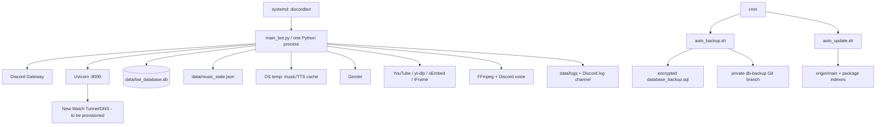

# 01. Current System Overview

## 운영 맥락

현재 V1은 친구용 Discord 서버 1개와 개인 관리·로그 서버 1개를 단일 Python 프로세스로
지원한다. 새 production target은 Raspberry Pi 5와 Ubuntu Server 24.04 LTS ARM64이며,
Ethernet/LAN을 주 연결로 사용한다. OS 재설치 뒤의 깨끗한 host에는 Discord Bot V2,
Watch Web, SQLite, media/runtime dependency와 운영 도구만 둔다. RAM/storage/filesystem의
실제 값과 acceptance baseline은 PHASE 9 staging inventory 전에는 확정값으로 사용하지 않는다.
음악 주크박스에서 출발해 대화 요약, XP, 생일,
Watch Together, 운영 자동화가 같은 bot에 추가됐다. 제품 의도는
[`docs/product-spec.md`](../product-spec.md), 운영 절차는
[`docs/operations.md`](../operations.md)가 현재의 우선 근거다.

## 실행 배치

systemd unit와 cron 정의는 저장소 파일이 아니라 문서의 수동 설정 예시다. 기존
Cloudflare Tunnel/DNS는 폐기됐고 새 Watch tunnel은 아직 구성하지 않았다. 새 Pi의 unit,
cron, tunnel, firewall, Discord application 설정은 PHASE 8/9에서 검증한다. 과거
WordPress/CloudPanel 환경은 목표 runtime이나 비교 baseline에 포함하지 않는다.

## 시작 순서

1. `main_bot.py`가 루트 `.env`를 읽는다.
2. `MyBot`은 mention-prefix와 default intents에 message-content/members intent를 켠다.
3. `setup_hook()`이 `database_manager.init_db()`를 기본 executor thread에서 기다린다.
4. DB가 없으면 로컬 암호화 SQL 또는 비공개 remote branch 복구를 시도하고 schema를
   준비한다.
5. Uvicorn을 같은 asyncio loop의 background task로 `0.0.0.0:8000`에 시작한다.
6. Log, Summary, Music, Leveling, Commands, Birthday, Watch Cog를 순서대로 load한다.
7. 개별 Cog load 실패는 log만 남기고 다음 Cog와 global command sync를 계속한다.
8. ready event 6개가 로그 panel, message preload, music dashboard/복원, voice XP 복원,
   stale Watch cleanup, presence 변경을 각각 수행한다.

근거: [`main_bot.py`](../../main_bot.py#L37), 특히 Cog 목록 L41–49, DB 선행 L55–58,
Uvicorn L59–73, extension loop L76–100, sync L102–109이다.

## 종료 순서

`MyBot.close()`는 Uvicorn에 종료를 요청한 뒤 discord.py의 `Bot.close()`를 호출한다.
discord.py는 extension/Cog를 unload하므로 음악 snapshot 저장, 음악 task/cache 정리,
요약 client 종료, logging handler 제거가 시도된다. 이후 Uvicorn이 5초 안에 끝나지
않으면 task를 cancel한다. SIGKILL, 전원 손실, process crash에서는 이 경로가 보장되지
않는다.

## 현재 논리 구성요소

| 구성요소 | 책임 | 직접 결합 |
| --- | --- | --- |
| `main_bot.py` | config load, bot 생성, DB gate, Uvicorn, Cog load/sync, process lifecycle | database manager, FastAPI global app, 모든 Cog 경로 |
| `database_manager.py` | 연결 설정, recovery, schema, dump/encryption, 모든 도메인 CRUD | SQLite, Git subprocess, Fernet, 모든 기능 |
| `application_commands.py` | `/요약`, `/재생`, `/시청` route | 문자열 Cog lookup, `bot.log` hidden injection |
| `music_agent.py` | Discord 요청·voice event·TTS·state registry | MusicState, UI, DB wrappers, yt-dlp, gTTS, FFmpeg |
| `music_core.py` | queue/state/play loop/autoplay/retry/UI rendering | Discord object, playback, UI, DB wrapper |
| `summary/*` | message memory와 Gemini prompt/parse | global Gemini client, fixed channel |
| `leveling`, `birthday` | Discord event 안에서 rule 계산과 DB 호출 | fixed IDs, shared users table |
| `watch_together/*` | invite, HTTP/WS relay, session lifecycle | FastAPI global state, Discord bot, DB global functions |
| `logging/log_agent.py` | logging config, Discord sink, admin buttons | root logger, bot, music, watch, shell script |
| `scripts/*` | in-place update, package maintenance, backup | hard-coded Pi paths, Git, pip, Deno, systemd |

## 상태 소유권

| 상태 | 현재 owner | 수명/한도 |
| --- | --- | --- |
| guild 음악 queue/current/voice/mode | `MusicState` | process lifetime; queue 상한 없음 |
| 음악 state registry | `MusicAgentCog.music_states` | guild별, 생성 경쟁 방지 없음 |
| YouTube cache | guild별 `DownloadPlaybackBackend` | guild마다 기본 512MB, 24시간 |
| TTS cache | `MusicAgentCog`의 공용 temp dir | 시작 시 1일 이상 파일 삭제, size 상한 없음 |
| 요약 원문 | process-wide deque | 기본/설정 max 1,000, 시간 retention |
| voice XP session | `LevelingCog.voice_sessions[user_id]` | 정상 leave/unload까지; guild가 key에 없음 |
| Watch connection/user/task | module-global `manager` dict | session/connection 상한과 idle timeout 없음 |
| Gemini client | module-global variable | Summary Cog lifetime |
| DB serialization | module-global `asyncio.Lock` | 모든 table/read/write가 공유 |
| Discord log dedupe | handler dict | 최근 60초 distinct message |

## 현재 장애 격리 수준

- FFmpeg와 download yt-dlp는 subprocess이므로 process 경계 일부가 있다.
- 대부분의 blocking Python 호출은 thread로 옮겼지만 전용 pool이나 capacity가 없다.
- Cog 내부 예외를 잡는 곳은 많지만 오류를 분류하지 않고 광범위하게 삼키는 경우가 많다.
- Watch web workload, Discord callback, background task는 같은 loop를 공유한다.
- extension 하나가 load 실패해도 process는 online이 되므로 기능별 degraded state를
  사용자와 운영자가 확실히 알 수 없다.
- systemd가 process crash를 재시작하지만 application readiness와 데이터 복구 성공을
  검증하지 않는다.

## 확인된 동작과 미확인 운영 상태

코드와 test로 인터페이스와 정책은 확인했지만 다음은 미확인이다.

- 실제 `.env` 값과 어떤 조건부 기능이 켜져 있는지
- 실제 bot invite permission과 privileged intent 승인
- 채널별 Discord ACL, Cloudflare Tunnel/방화벽 정책
- 운영 guild/user/session/queue의 최대·평균 부하
- 현장 command latency, event-loop lag, RSS/CPU, DB lock wait
- 최근 crash stack과 systemd restart 횟수
- backup restore drill 결과와 실제 RPO/RTO
