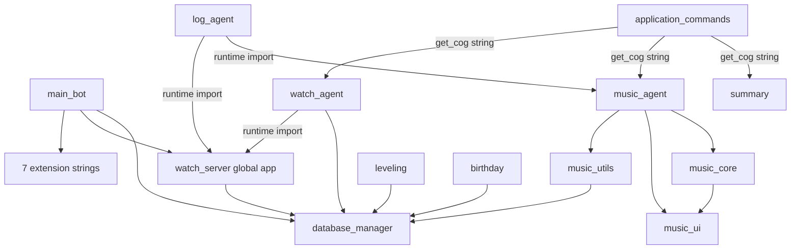

# 02. Repository Map

## 정량 지도

| 항목 | 수치 |
| --- | ---: |
| Git 추적 파일 | 56 |
| runtime Python 파일 | 21 |
| runtime Python 줄 | 4,976 |
| test 파일 | 20 |
| test 줄 | 2,760 |
| HTML player | 1,606줄 |
| 가장 큰 Python module | `database_manager.py` 744줄 |
| 명시된 build/lint/format/type-check | 없음 |
| CI/CD workflow/Docker/migration framework | 없음 |

## 디렉터리와 파일 책임

```text
DiscordBot/
├── main_bot.py                    # entry point, composition과 lifecycle
├── database_manager.py            # recovery/schema/backup + 모든 CRUD
├── cogs/
│   ├── application_commands.py    # 요약/재생/시청 route
│   ├── birthday/birthday_core.py
│   ├── leveling/leveling_core.py
│   ├── logging/log_agent.py
│   ├── music/
│   │   ├── music_agent.py         # Discord/voice/TTS orchestration
│   │   ├── music_core.py          # state/play loop/retry/autoplay/UI update
│   │   ├── music_playback.py      # direct/download backend
│   │   ├── music_state_store.py   # JSON snapshot
│   │   ├── music_session_restorer.py
│   │   ├── music_ui.py
│   │   └── music_utils.py         # yt-dlp와 DB compatibility exports
│   ├── summary/
│   │   ├── summary_listeners.py
│   │   └── summarizer_agent.py
│   └── watch_together/
│       ├── watch_agent.py
│       ├── watch_server.py
│       └── templates/player.html
├── scripts/
│   ├── auto_update.sh
│   ├── auto_backup.sh
│   └── install_pot_provider.sh
├── tests/                          # pytest, 실제 DB/외부 통신 격리
└── docs/                           # 제품/운영/현행 설계 + 본 재구축 설계
```

## 진입점과 dependency 방향



정적 import cycle은 확인되지 않았지만, `get_cog()` 문자열 lookup, `bot.log` 주입,
`app.state.bot`, UI가 `Any`형 Cog callback을 호출하는 runtime cycle이 경계를 숨긴다.

## 선언된 runtime dependency

| 범주 | 직접 dependency | 용도 |
| --- | --- | --- |
| Discord | `discord.py[voice]>=2.7.1` | Gateway, app command, UI, voice |
| AI | `google-genai>=2.14.0` | Gemini summary |
| media | `yt-dlp[default]>=2025.12.8`, `bgutil-ytdlp-pot-provider==1.3.1` | 검색/metadata/download/PO token |
| web | `fastapi>=0.139.2`, `pydantic>=2.9.0`, `aiohttp>=3.14.3`, `uvicorn>=0.49.0`, `websockets>=12.0` | Watch web/WS/oEmbed |
| crypto/config | `cryptography==42.0.5`, `python-dotenv>=1.1.1` | backup envelope, `.env` |
| UX | `rich>=14.1.0`, `gTTS>=2.5.4`, `RapidFuzz>=3.14.1` | console, join TTS, autoplay dedupe |
| test | pytest, pytest-asyncio, httpx, httpx2 | test only |

개발 가상환경에서 확인한 값은 Python 3.12.14, discord.py 2.7.1, FastAPI 0.139.2,
Uvicorn 0.51.0, aiohttp 3.14.3, yt-dlp 2026.07.04다. 이는 로컬 관찰값이지 Pi의
정확한 lockfile이 아니다. 일반 dependency 대부분은 하한만 있어 재설치 결과가 달라질 수 있다.

## system dependency와 외부 실행 파일

- FFmpeg: 음악 decode/Discord voice, TTS mp3→Opus
- Deno: YouTube challenge와 PO-token provider
- Git: source update, private backup fetch/push
- Bash, systemd, cron, curl, unzip, sqlite3: 운영 문서/스크립트
- 새 Watch Tunnel/DNS: 기존 Cloudflare 구성은 폐기됐고 새 설정 파일은 아직 저장소에 없음

## 환경 변수

| 변수 | 소비자 | 필수/기본 | 관찰 |
| --- | --- | --- | --- |
| `DISCORD_TOKEN` | main | 필수 | 없으면 process 종료 |
| `GOOGLE_API_KEY` | summary | 조건부 필수 | 없으면 summary 내부 비활성 |
| `DB_ENCRYPTION_KEY` | backup/restore | backup 필수 | 없으면 새 backup 중단 |
| `DB_BACKUP_REMOTE_URL` | recovery/backup | 무데이터 recovery 필수 | 공개 origin fallback 없음 |
| `MASTER_USER_ID` | birthday/music/log | 기본 0 | 단일 전역 관리자 |
| `MUSIC_CHANNEL_ID` | music | 기본 0 | 0이면 Music Cog 미등록 |
| `SUMMARY_CHANNEL_ID` | summary/birthday | 기본 0 | 두 기능이 같은 채널 공유 |
| `LOG_CHANNEL_ID` | logging/admin | 기본 0 | Discord sink 비활성 가능 |
| `WATCH_TOGETHER_URL` | Watch invite | localhost:8000 | 외부 domain |
| `MUSIC_PLAYBACK_BACKEND` | playback | `download` | `direct` legacy rollback |
| `MUSIC_CACHE_MAX_BYTES` | playback | 512MiB **per guild** | process 전체 상한 아님 |
| `MUSIC_TRACK_MAX_BYTES` | playback | 100MiB | 개별 download |
| `MUSIC_CACHE_MAX_AGE_SECONDS` | playback | 86400 | access-time 기반 |
| `GEMINI_MODEL`, `TEMPERATURE` | summary | 코드/템플릿 기본 | model behavior |
| summary token/history/retention 변수 | summary | 코드 기본과 envtemplate 값 일부 상이 | typed validation 없음 |
| `TIMEZONE_OFFSET_HOURS` | summary | 9 | birthday는 별도 KST 상수 |
| `YTDLP_POT_PROVIDER_DIR` | music | 사용자 home fallback | envtemplate에 없음 |
| `DEBUG_MODE` | 없음 | envtemplate에만 있음 | dead configuration candidate |

숫자 환경 변수 다수는 module import 때 바로 `int/float` 변환된다. 오타 하나가 해당
extension load를 실패시킬 수 있지만 startup은 계속될 수 있다.

## persistence와 생성 파일

실제 내용은 읽지 않고 경로만 확인했다.

- `data/bot_database.db`: 현재 존재, Git ignore
- `data/database_backup.sql`: 현재 존재, 이름과 달리 V2는 암호화 envelope
- `data/music_state.json`: 종료 시 조건부 생성, 현재 없음
- `data/logs/*`, `data/archives/*`, `data/update_pending`, `data/startup_reason.txt`
- OS temp의 `discordbot_music_cache/<guild>`와 `bot_tts_cache`

## test/automation 지도

`tests/conftest.py`가 session 전체에서 DB와 SQL backup 경로를 임시 디렉터리로 바꾼다.
현재 test는 외부 API/Discord를 mock하고 130개가 통과했다. 다만 coverage threshold,
static analysis, load/concurrency test, release CI가 없다. `scripts` test는 실제 실행이
아니라 주로 shell text의 안전 속성을 검사한다.

## active/conditional/dead 후보

| 구분 | 항목 |
| --- | --- |
| active | 8 slash command, default prefix `help`, 7 extension load 시도, FastAPI app |
| conditional | Music channel, Gemini, birthday loop, Discord log, TTS, playback backend, PO provider |
| dead/orphan 가능성 높음 | `TopSongButton`, `FFMPEG_OPTIONS`, `Song.to_embed`, runtime 미사용 `load_music_states`, volume setter/UI, browser의 일부 변수, `DEBUG_MODE` |
| 확인 필요 | 운영 script가 실제 cron/systemd에 등록됐는지, direct backend 실제 사용 여부 |
