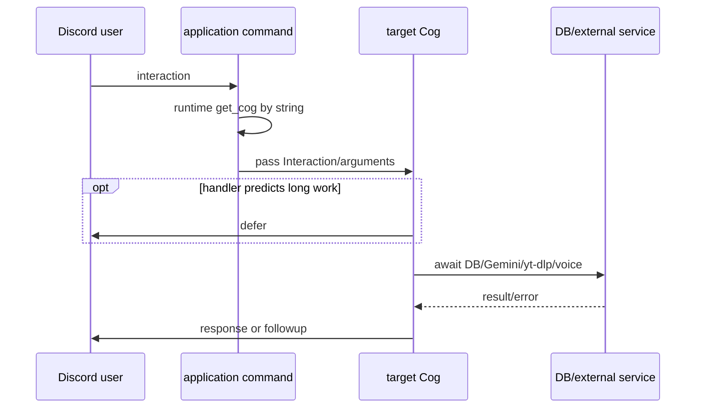
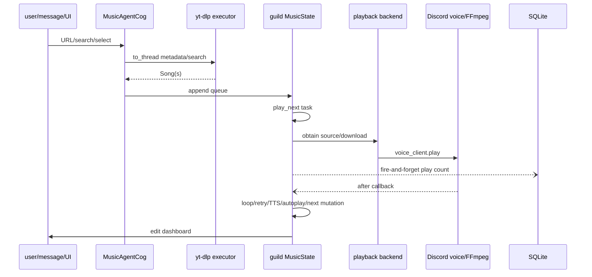
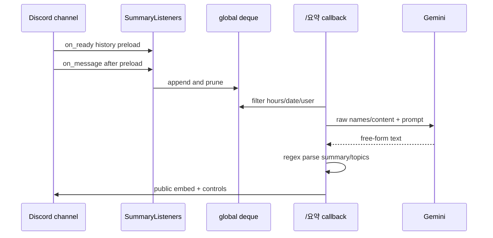
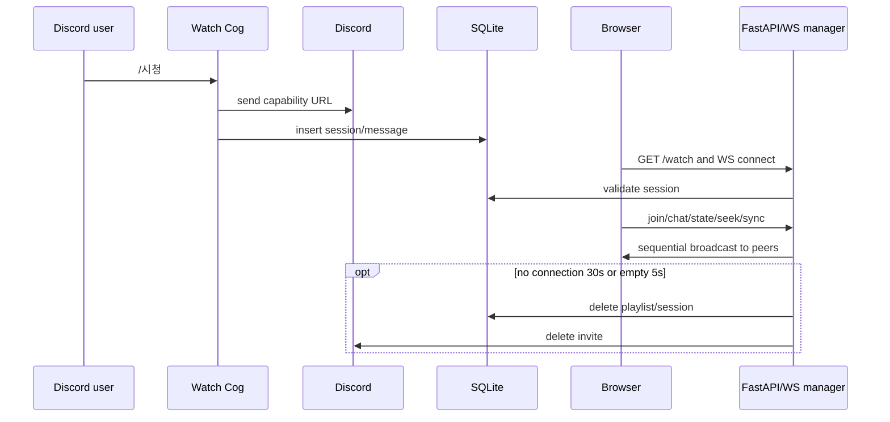
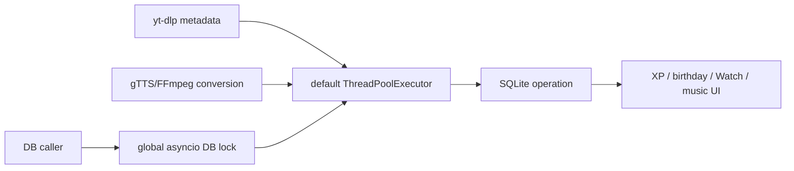

# 05. Runtime Flow

## Process startup and shutdown

```mermaid
sequenceDiagram
    participant S as systemd
    participant B as main_bot
    participant DB as database_manager
    participant W as Uvicorn task
    participant D as Discord
    S->>B: Python process
    B->>DB: init_db via default executor
    alt DB path absent
        DB->>DB: local or remote encrypted restore
    end
    DB->>DB: inline schema create/ALTER
    B->>W: create_task(server.serve)
    loop seven extensions
        B->>B: load_extension; catch and continue
    end
    B->>D: global tree.sync
    D-->>B: ready/reconnect
    B->>B: six on_ready handlers
    Note over B,D: online can be shown after partial extension/web failure
    S->>B: stop/restart
    B->>W: should_exit=true
    B->>B: Cog unload/cleanup
    B->>W: wait 5s then cancel
```

DB readiness blocks all later startup, while logging Cog is not yet installed. Uvicorn task failure is
not supervised. Abnormal termination skips music snapshot, voice XP settlement and normal cleanup.

## Slash interaction



위 흐름은 명령별로 동일하지 않다. 생일 command는 DB 대기 전 defer하지 않고,
`/시청`은 DB commit 전 초대를 응답한다. interaction response 상태를 한 곳이 소유하지
않아 timeout과 이중 응답이 가능하다.

## Music request and playback



- metadata completion order, not request order, decides queue order under concurrency.
- `MusicState`, UI callback, voice `after`, TTS and autoplay share state without one owner.
- download has a per-guild lock and 180-second attempt timeout; metadata/direct/gTTS do not have a
  complete deadline policy.
- retry waits 3 and 8 seconds and skips after the third failure. Autoplay prefetch calls an undefined
  name, logs/swallowing the error, so the intended success path is currently broken.
- cache scan/delete uses synchronous filesystem operations in the event loop in places.

## Summary



초기 load 중 live message가 수집되지 않을 수 있고 message ID dedup이 없다. Gemini call에는
hard timeout, retry budget, concurrency limit이 없다. source channel ACL을 검사하지 않고 raw
content를 외부로 보낸다.

## XP and birthday

Text event는 글자 구성을 계산해 `users`를 갱신한다. voice event는 process memory의
`voice_sessions[user_id]`에 시작 시간을 넣고 퇴장/unload 때 DB에 합산한다. channel move와
multi-guild key가 불명확하며 crash 시 세션이 사라진다. `/내정보`는 완전한 분만 XP로
바꾸지만 ranking SQL은 초 단위 소수를 반영해 결과가 달라질 수 있다.

Birthday loop는 KST 09:00에 guild별 당일 사용자를 조회하면서 하나의
`SUMMARY_CHANNEL_ID`로 알린다. 여러 guild에서는 다른 guild 사용자가 같은 channel로
노출될 수 있다.

## Watch Together



초대와 commit 순서가 뒤집혀 click race가 있다. close/connect 및 oEmbed add/close에도
transactional ownership이 없다. browser는 terminal close 뒤에도 3초 간격으로 무기한
재연결하고, startup stale cleanup보다 먼저 연결되면 과거 session이 보존될 수 있다.

## Shared contention path



미디어 thread가 pool을 포화시키면 첫 DB caller가 lock을 가진 채 executor slot을 기다린다.
그 뒤의 모든 DB 요청이 lock 뒤에 누적된다. 이는 추측성 일반론이 아니라 현재 호출
순서로 성립하는 전체 기능 정체 경로다.

## Task lifecycle inventory

| task | 생성 | owner/종료 | 위험 |
| --- | --- | --- | --- |
| Uvicorn | `setup_hook create_task` | bot close 5초 | 조기 crash 미감시 |
| music play/UI/autoplay | MusicState/Cog | 여러 task field와 unload | raw task 예외·상태 경쟁 |
| play count | playback start | owner 없음 | 종료 손실·exception 비관찰 |
| TTS | voice event | Cog 일부 | 실제 재생 기간 lock 미보호 |
| summary prune/preload | Summary Cog | unload 일부 | preload failure 재시도 없음 |
| birthday daily loop | Birthday Cog | discord task loop | channel/guild 정책 결합 |
| Watch self-destruct | module manager | dict/cancel | connect/close race, 상한 없음 |
| Discord log send | logging handler | thread-safe future | future 결과 미관찰, 폭주 가능 |
