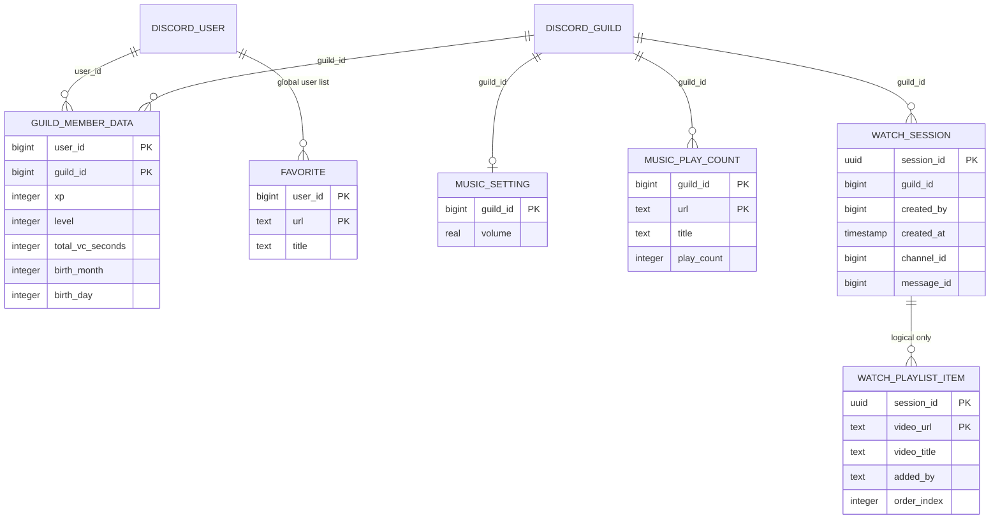

# 06. Data Model

## Current relational model

| table | key / 주요 column | writer / reader | lifecycle·consistency |
| --- | --- | --- | --- |
| `users` | PK `(user_id,guild_id)`; xp, level, total_vc_seconds, birth month/day | leveling/birthday/favorite helper; profile/rank/birthday | 무기한; guild member 의미와 favorite용 `(user,0)` ghost row 혼재 |
| `music_settings` | PK `guild_id`; volume default 1.0 | setter API; MusicState creation | setter live caller 없음; state default 0.5와 불일치 |
| `music_play_counts` | PK `(guild_id,url)`; title,count | playback start; dashboard | guild당 top 50 보존; retry/resume 중복 의미 |
| `favorites` | PK `(user_id,url)`; title | favorite UI | 사용자 전역, 무제한 |
| `watch_sessions` | PK `session_id`; guild,creator,time,channel,message | Watch Cog/manager | 강제/자동 종료까지; hard max TTL 없음 |
| `watch_playlists` | PK `(session_id,video_url)`; title,added_by,order_index | HTTP API | session 종료 시 명시 삭제 |

모든 관계는 코드상 논리 관계일 뿐 FK가 없고 `foreign_keys=ON`, `CHECK`, schema version,
migration ledger도 없다. 부분 inline `ALTER`는 pair column 중 하나만 확인하므로 반쪽 schema를
복구하지 못할 수 있다.

## File, cache and memory state

| store | schema/identity | writer / reader | retention / concurrency |
| --- | --- | --- | --- |
| `data/music_state.json` | guild → channel, volume, loop, autoplay, current/elapsed, queue | unload/update; next ready | parse 직후 삭제; version/ack 없음; mutable snapshot race |
| encrypted `database_backup.sql` | V2 marker + Fernet encrypted SQL dump; legacy restore | cron/startup | local latest + archives 약 7일 + remote latest 1개 |
| music temp cache | guild/SHA256 URL file | yt-dlp/FFmpeg | 24h, 512MiB **guild별**, track 100MiB |
| TTS temp cache | SHA256 text `.opus` | gTTS/FFmpeg/voice | startup에서 atime 1일 초과 삭제, size 한도 없음 |
| summary deque | datetime,guild,user,display name,content | Discord history/message; summary | memory only, count/time bound |
| music state dict | guild → mutable `MusicState` | callbacks/tasks | process lifetime, queue unbounded |
| voice sessions | user → join time/state | voice events | normal leave/unload; crash loss; guild key 없음 |
| Watch manager dicts | session → sockets/names/tasks | HTTP/WS lifecycle | process lifetime; count/TTL 상한 없음 |

## Current access policy

각 async DB 함수가 새 SQLite connection을 만들고 하나의 process-global `asyncio.Lock`을
잡은 채 `asyncio.to_thread`를 기다린다. WAL은 startup에서 설정되지만 모든 table과 read/write가
application 수준에서 직렬화된다. cron backup은 별도 process라 이 lock과 조정되지 않으며,
`iterdump()`에 명시적 snapshot transaction이 없다.

## Recovery rules and gaps

- DB path가 **없을 때만** local backup 또는 private remote 복구를 시도한다.
- 존재하는 0-byte/corrupt-looking DB는 복구 경로를 우회해 schema 생성 또는 startup 실패가
  가능하다.
- local backup이 존재하지만 잘못되면 good remote로 fallback하지 않는다.
- remote file을 canonical path로 바로 쓰고 검증 후 atomic publish하지 않는다.
- dump validation은 SQL 실행과 transaction 문자열 중심이며 expected schema/row count/logical
  integrity를 확인하지 않는다.
- encryption key version/rotation contract와 정기 restore drill은 없다.

## Target logical model

새 domain은 `DiscordUser`, `GuildMembership`, `Favorite`, `GuildMusicSettings`,
`TrackPlay`, `WatchSession`, `WatchPlaylistItem`을 분리한다. `users(user,0)`는 요구사항이 아닌
호환 migration 문제다. URL을 canonical video ID로 바꾸거나 play-count 의미를 바꾸는 것은
기존 key/통계를 변경하므로 별도 승인 전에는 하지 않는다.

전환기 원칙은 expand/contract, old reader 호환, backup 선행, checksum을 가진 순차 migration,
idempotent resume, row-count/semantic validation, rollback window 동안 구 schema read 가능이다.
SQLite 유지/교체 결정은 [ADR-002](23-decision-log.md#adr-002-database)에 남긴다.
