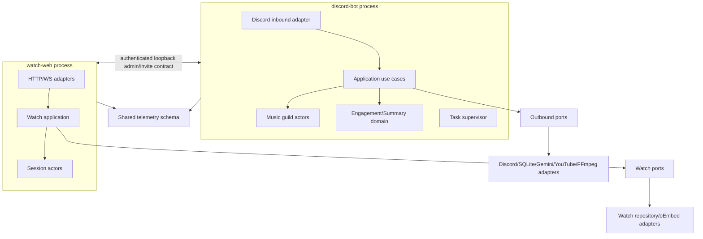

# 14. Target Architecture

## 선택

하나의 codebase 안의 **hexagonal modular monolith**를 사용하고, internet-facing Watch
runtime만 별도 process로 분리한다. 두 process는 동일한 domain/application package를
사용하되 lifecycle과 capacity를 공유하지 않는다. 현재 규모에는 Redis/Kafka/Kubernetes가
필요하지 않다.

## Layer responsibilities

| layer | 책임 | 금지 |
| --- | --- | --- |
| inbound adapter | Discord ACK/defer, input DTO, response rendering; HTTP/WS parse/auth | DB/vendor direct call, business branch |
| application | use case orchestration, authorization policy invocation, transaction/idempotency boundary | framework object 보관 |
| domain | XP/date/music/session state machine, invariant/value object/domain event | Discord/FastAPI/SQLite/vendor import |
| ports | repository, AI, media, clock, ID, notifier, task scheduling interface | implementation detail |
| outbound adapter | SQLite, Discord REST/voice, Gemini, yt-dlp, FFmpeg, oEmbed | rule 결정 |
| worker/actor | bounded mailbox, one state owner, retry/deadline/cancel 실행 | unbounded raw task spawn |
| composition | typed config, resource lifecycle, health, dependency wiring | feature logic |
| observability | context propagation, logs/metrics/health | raw secrets/content |

## Bounded contexts

- **Music**: queue, playback state machine, favorites, play statistics, snapshot. guild actor가
  state mutation의 유일한 owner다.
- **Summary**: message capture cursor/retention, authorization, prompt boundary, result parse.
- **Engagement**: text/voice XP, profile/ranking, birthday policy/schedule.
- **Watch**: session/participant/playlist state machine과 public protocol.
- **Operations**: readiness, backup, release, admin use cases, audit.

Context는 서로 table/function을 호출하지 않고 application contract 또는 명시적 domain
event를 사용한다. 예를 들어 favorite의 global user identity가 engagement `users` row
생성을 암묵 요구하지 않는다.

## Process and storage ownership

`discord-bot`은 Gateway, voice, command, summary, engagement, music을 소유한다.
`watch-web`은 public HTTP/WS와 session actor를 소유한다. Discord invite/삭제와 master close는
짧고 인증된 loopback contract로 조정한다. 어떤 process가 Watch SQLite write의 단일 owner가
될지는 ADR-004/BLOCKER로 확정한다; 둘이 같은 table을 임의로 쓰지 않는다.

초기 persistence는 compatibility repository 뒤의 SQLite다. writer serialization은 DB
worker가 소유하고 read는 snapshot semantics를 보장한다. 데이터량/lock SLO가 실제로
SQLite 한계를 넘을 때만 Postgres ADR을 재개한다.

## Request lifecycle

1. adapter가 correlation context를 만들고 validation/authz를 수행한다.
2. 예상 800ms를 넘으면 즉시 defer/202를 확정한다.
3. application이 deadline과 idempotency key를 전달해 use case를 호출한다.
4. actor/repository/external port가 자체 capacity와 remaining deadline을 적용한다.
5. typed result/error가 adapter에서 기존 UX로 변환된다.
6. 모든 phase가 duration/result metric과 구조화 event를 남긴다.

## Failure isolation

- optional adapter는 circuit-open/degraded가 되어도 composition을 죽이지 않는다.
- 필수 DB/config/schema 실패는 read-only/fail-closed와 readiness=false다.
- actor exception은 해당 guild/session supervisor가 기록·재시작/정리하며 main loop에
  전파하지 않는다.
- slow Watch peer, Gemini, download, logging은 각각 다른 capacity를 사용한다.
- deployment는 readiness와 smoke를 통과하기 전 traffic/release pointer를 넘기지 않는다.
