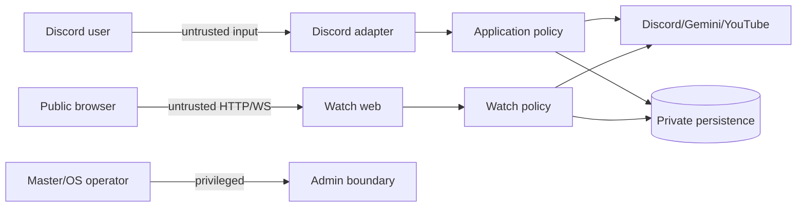

# 18. Security and Privacy Review

## Threat surface

| 영역 / 위험 | 현재 관찰 | severity | target control |
| --- | --- | --- | --- |
| Discord admin authorization | 단일 `MASTER_USER_ID`; role/default permission 없음 | HIGH if misconfigured | typed actor policy, deny-by-default, audit, optional role decision |
| Summary confidentiality | source ACL 미검사, raw name/content를 Gemini에 전달 | HIGH | requester source ACL, consent/notice, minimization/redaction, retention |
| Watch capability | UUID를 아는 누구나, public `0.0.0.0`, no login은 제품 계약 | HIGH | TLS, strong capability, no referrer/log leak, expiration/revocation |
| Watch browser/API | Origin/CSRF/CSP/rate/size/schema/cap 부족 | HIGH | allowlisted Origin, CSRF for HTTP mutation, CSP, Pydantic/WS schema, quotas |
| Watch admin channel | same-process bot object/manager 결합 | HIGH | authenticated least-privilege loopback API, replay protection |
| WebSocket amplification | arbitrary frame relay, sequential send | HIGH | max frame, known type/version, token bucket, fanout/client caps, timeout |
| logs | file sink에 IDs/URL/title/session/credential error 가능 | HIGH | classification, central redaction/hash, ACL/retention, secret scanning |
| backup | V2 Fernet는 좋으나 one key/rotation/restore policy 없음 | HIGH | key ID/rotation/old-key escrow, restrictive file modes, restore drill |
| DB/input | parameterized SQL 위주이나 schema constraint 부족 | MEDIUM | repository-only parameters, domain+DB constraints via approved migration |
| shell/deployment | Git remote/commands, sudo/systemd, supply chain | HIGH | no secrets in argv/log, pinned artifacts, restricted sudo, provenance |
| temp media | URL-derived content와 TTS가 local disk | MEDIUM | private permissions, size/TTL, atomic file, cleanup and no backup |
| privileged intents | message content/members 요청 | MEDIUM | documented necessity, Developer Portal review, data minimization |

## Trust boundaries

모든 boundary에서 normalize/schema/length/range/enum/authz를 수행하며 vendor가 돌려준
title/body도 신뢰하지 않는다. browser 출력은 text APIs/escaped templates를 유지하고 URL은
YouTube allowlist/canonicalization을 거친다.

## Secret and privacy policy

- Discord/Gemini/Fernet/remote credentials는 `.env`를 repository에 넣지 않는 기존 원칙을
  유지하되 systemd credential/environment file 권한과 rotation owner를 정의한다.
- startup은 secret 존재만 보고하고 값/부분값을 출력하지 않는다.
- backup key 분실은 데이터 복구 불가이므로 code/DB와 분리된 secure copy, key version,
  restore rehearsal가 필요하다.
- 음악 URL/title은 취향 정보, user/channel ID는 개인정보, Watch link는 bearer secret으로
  분류한다. log/metric label/alert에서 원문을 제거한다.
- summary data의 Google 전송 legal/consent/retention은 BLOCKER에 가까운 HIGH 결정이다.

## Permission model decisions

현재 친구 서버 신뢰 모델과 no-host Watch는 유지할 수 있다. 다만 login을 추가하지 않는 것과
아무 제한도 두지 않는 것은 다르다. capability expiry/revocation, server-side session check,
rate/cap, TLS/Origin은 UX를 바꾸지 않고 필요한 방어다. `MASTER_USER_ID`만 유지할지 Discord
Administrator/role을 추가할지는 사용자 결정 전 변경하지 않는다.

## Security verification

secret/log snapshot test, authorization matrix, cross-guild isolation, source-channel ACL,
malformed/oversized WS/HTTP fuzz, XSS/CSP, CSRF/Origin, replay/idempotency, rate/load, dependency
audit, encrypted backup wrong-key/tamper/rotation restore, restricted OS file permission과 threat
model review를 release gate로 둔다.
