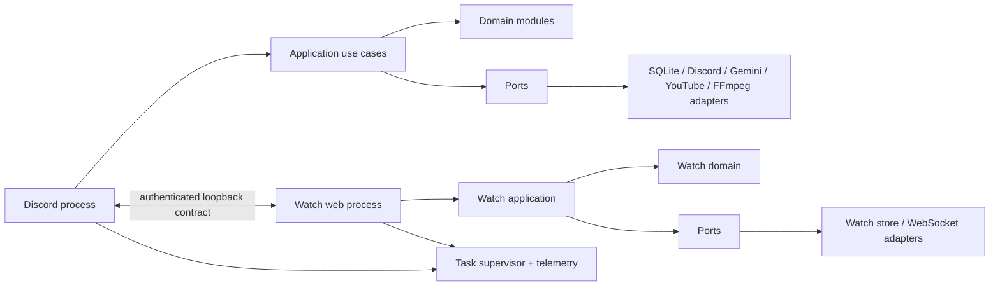

# 00. Executive Summary

## 결론

현행 봇의 기능 자체는 비교적 명확하지만, 실행 격리와 상태 소유권이 불명확하다.
Discord Gateway, 외부 공개 FastAPI/WebSocket 서버, 미디어 작업, Gemini, SQLite,
Discord 로그 전송이 한 프로세스와 한 이벤트 루프에 모여 있다. 특히 기본 thread
executor와 전역 DB lock의 결합은 느린 미디어 작업이 XP, 생일, Watch Together,
음악 UI까지 연쇄 지연시킬 수 있는 구체적인 전체 시스템 정체 경로다.

새 시스템은 마이크로서비스 묶음이 아니라 **경계가 강한 모듈러 모놀리스**로 시작하되,
인터넷에 노출되는 Watch Together 런타임만 별도 프로세스로 격리하는 안을 제안한다.
Redis, Kafka, Kubernetes는 현재 규모에서 도입하지 않는다. SQLite는 초기 전환에서
호환 adapter 뒤에 유지하고 실제 부하·복구 목표가 이를 초과할 때만 재검토한다.

PHASE 0에서 사용자 결정을 닫고 V1 baseline/requirement trace를 작성했다. feature 구현 전
characterization test 보강은 여전히 필요하며 운영 기준선 측정과 데이터 복구 훈련은 각각
staging/operations gate에서 수행한다.

## 분석 기준과 검증

| 항목 | 결과 |
| --- | --- |
| 기준 시점 | 2026-09-04, `main` / `8432fde` |
| 저장소 규모 | 추적 파일 56개, runtime Python 21개/4,976줄, test 20개/2,760줄 |
| 인터페이스 | 명시적 slash command 8개, 암묵적 mention-prefix `help` 1개 |
| 기능 수 | 이 문서의 경계 기준 45개(F001–F045) |
| Discord UI | button 동작 약 25종, select 4종, modal 2종 |
| 웹 인터페이스 | HTTP 4개, WebSocket 1개, client message type 7개 |
| 자동 test | `pytest tests/ -q`: 130 passed, 1 warning, 3.74초 |
| test 경고 | Python 3.13에서 제거 예정인 `audioop` 사용 경고 |
| 운영 데이터 | 파일명과 크기만 확인; DB·백업·로그 내용은 열지 않음 |
| 수정 범위 | 이 디렉터리의 문서만 추가 |

테스트 통과는 현재 자동 검사 범위만 의미한다. 추천재생 성공 경로, 실제 Discord
interaction deadline, 느린 WebSocket peer, thread pool 포화, 운영 복구는 포함하지 않는다.

## 가장 중요한 발견

| ID | 심각도 | 발견 | 근거와 결과 |
| --- | --- | --- | --- |
| AUD-001 | CRITICAL | 기본 executor 포화가 전역 DB lock 대기로 증폭됨 | DB 호출은 lock을 잡고 `to_thread`를 기다리며, yt-dlp·gTTS도 같은 executor를 사용한다. 모든 기능의 DB 접근이 멎을 수 있다. |
| AUD-002 | CRITICAL | 존재하지만 비정상인 DB가 자동 복구를 우회할 수 있음 | 파일 존재 여부만으로 복구 여부를 결정한다. 0-byte 파일도 schema 생성으로 새 빈 DB가 될 수 있다. |
| AUD-003 | HIGH | 추천재생 실제 경로가 항상 `NameError`로 실패함 | `music_core.py`가 import하지 않은 `extract_ytdlp_info`를 호출한다. 성공 경로 test가 없다. |
| AUD-004 | HIGH | Watch 서버와 Discord가 같은 loop를 공유함 | 외부 client payload를 순차·무제한 broadcast하고 send timeout, schema, rate limit이 없다. 느린 peer나 폭주가 Discord 처리에 전파될 수 있다. |
| AUD-005 | HIGH | 부분 기동을 정상 기동처럼 취급함 | Cog load와 command sync 실패를 기록만 하고 online presence를 표시한다. 일부 기능 누락 상태가 readiness를 통과한다. |
| AUD-006 | HIGH | 음악 상태를 여러 callback/task가 잠금 없이 변경함 | queue, current song, voice, retry, UI 선택이 공동 변경된다. 요청 완료 순서 역전과 stale index 오작동이 가능하다. |
| AUD-007 | HIGH | 요약 권한과 자원 한도가 없음 | 대상 채널 열람 권한을 확인하지 않고 Gemini deadline·동시성 제한도 없다. 정보 노출과 장기 task 누적이 가능하다. |
| AUD-008 | HIGH | 배포 rollback이 코드만 되돌림 | live venv는 코드 배치 전에 변경되고 실행 간 `flock`이 없다. 중복 실행과 dependency 비호환을 원복하지 못한다. |
| AUD-009 | HIGH | 관측성이 원인 규명에 충분하지 않음 | interaction ID, 단계별 latency, event-loop lag, executor/DB-lock wait, queue depth, task health metric이 없다. |

세부 발생 조건, 장애 형태, 재현성과 제거 방법은
[성능·신뢰성 감사](09-performance-reliability-audit.md)에 기록했다.

## 유지해야 할 제품 계약

- 명령 이름, 응답 문구, 공개/비공개 응답, 버튼 의미
- 음악 queue, pause/resume, skip, 세 반복 모드, 자동재생, 사용자 전역 즐겨찾기
- 음성 채널·재생 위치·queue·모드의 재시작 복원
- 음악 실패 시 3초·8초 대기 후 세 번째 실패에서 skip하는 사용자 관찰 동작
- 지정 채널 대화와 공개 기본 요약, 비공개 topic 상세
- 기존 XP 공식과 guild별 데이터 의미, 생일 KST 09:00 알림
- Watch URL/endpoint/message 형식, 30초 개설 유예, 5초 빈 방 유예
- 별도 로그인·방장 없이 링크를 공유하는 Watch 모델과 master 전용 강제 종료
- SQLite, 암호화 backup, `music_state.json`의 전환기 호환성

`help`, 읽기만 가능한 volume 설정, direct playback backend와 일부 orphan symbol은
제품 계약인지 확정되지 않았다.

## 제안 목표 구조

핵심은 다음과 같다.

- Discord handler는 ACK, 입력 변환, use case 호출, 응답 변환만 담당한다.
- guild별 음악 actor가 모든 상태 전이를 직렬화한다.
- 장기 작업은 이름·owner·deadline·capacity가 있는 supervisor만 생성한다.
- DB는 repository 경계와 짧은 transaction을 사용하고 lock 대기를 계측한다.
- Watch 외부 트래픽은 Discord loop와 프로세스 수준에서 격리한다.
- 시작은 dependency readiness를 검증하고, 필수 기능 누락 시 online으로 표시하지 않는다.
- 구조화 log, metric, health와 correlation ID가 모든 경계를 연결한다.

## 남은 단계별 gate

1. `../current/open-questions.md`의 BLOCKER 결정 — 완료
2. PHASE 1: 8개 slash command, 암묵적 `help`, 모든 button의 golden behavior 확정
3. PHASE 1: 추천재생을 포함한 누락 characterization/concurrency/failure test 구현
4. PHASE 3: schema와 `music_state.json` 전환, backup/restore/7일 rollback proof
5. PHASE 6: 승인된 Watch 별도 process와 내부 제어 contract 검증
6. PHASE 9: 실제 Pi의 event-loop/command/DB/RSS/CPU 기준선과 staging E2E 측정
7. PHASE 10: production cutover 직전 final backup/restore/reconciliation과 사용자 승인

**Ready for PHASE 1 Characterization: YES**

**Ready for Feature Implementation: NO** — PHASE 1 exit 전에는 새 feature code를 작성하지 않는다.
