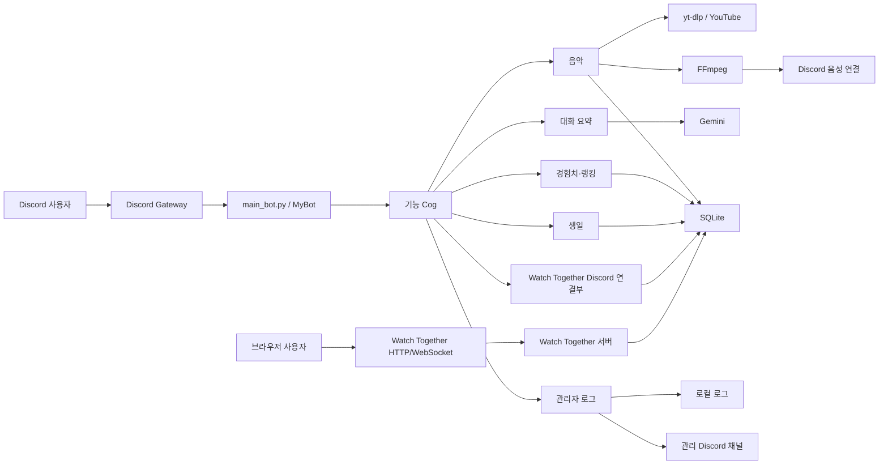
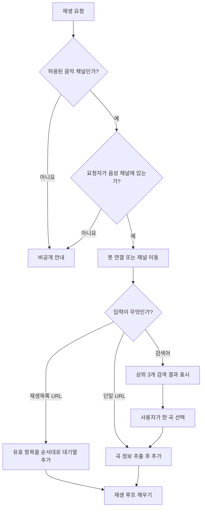
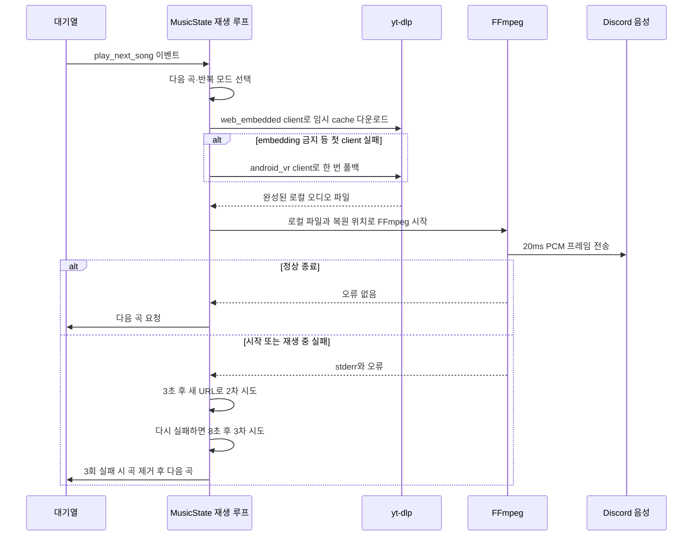
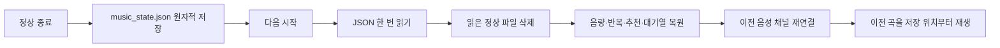
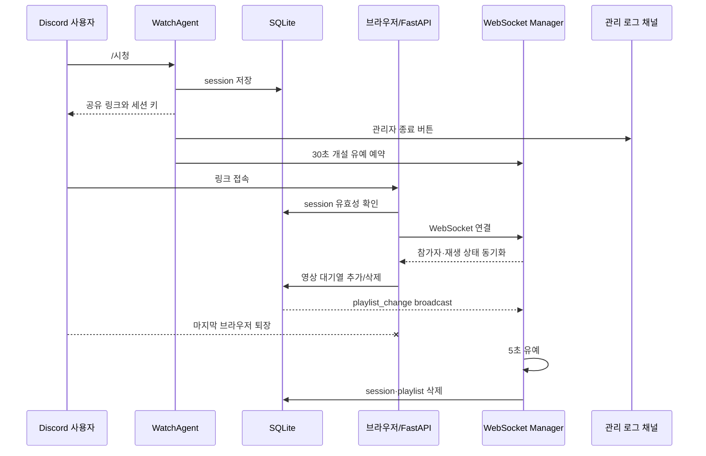

# 시스템 설계와 기능 흐름

이 문서는 현재 코드가 실제로 어떻게 동작하는지를 설명하는 현행 시스템 지도입니다.
사용자에게 보장할 동작은 `product-spec.md`, Raspberry Pi 운영 절차는
`operations.md`를 기준으로 하며, 이 문서는 구성요소 사이의 호출·상태·데이터
흐름을 설명합니다.

## 1. 전체 구조

### 시작 순서

1. `.env`를 읽고 Discord 봇 객체를 만듭니다.
2. 원격 백업 복구가 필요하면 복구한 뒤 SQLite schema를 준비합니다.
3. FastAPI/Watch Together 서버를 8000번 포트에서 시작합니다.
4. 로그, 요약, 음악, 경험치, 공용 명령, 생일, Watch Together Cog를 순서대로
   로드합니다.
5. Discord 슬래시 명령을 동기화합니다.
6. `on_ready` 이벤트마다 봇 상태를 표시하고 각 Cog가 자신의 대시보드나 복원
   작업을 수행합니다.

종료할 때는 음악 상태를 저장하고 백그라운드 작업, Discord 연결과 웹 서버를
정리합니다.

## 2. 사용자 유즈케이스

| 영역 | 진입점 | 주요 동작 | 결과 |
| --- | --- | --- | --- |
| 음악 추가 | `/재생`, 음악 채널 메시지, 검색 모달, 인기 곡, 즐겨찾기 | URL·검색어·재생목록 해석, 음성 채널 연결, 대기열 추가 | 현재 곡 또는 다음 곡으로 재생 |
| 음악 제어 | 대시보드 버튼 | 일시정지·재개, 건너뛰기, 반복, 추천재생, 종료 | guild별 음악 상태 변경 |
| 대기열 관리 | 대기열 버튼 | 맨 위 이동, 한 곡 삭제, 섞기, 전체 삭제 | 다음 재생 순서 변경 |
| 즐겨찾기 | 별·보관함 버튼 | 사용자 공용 즐겨찾기 추가·재생·삭제 | SQLite에 사용자별 저장 |
| 대화 요약 | `/요약` | 지정 채널 로그 필터링, Gemini 요약 | 공개 요약과 비공개 주제 상세 |
| 경험치 | 채팅·음성 활동 | 글자 길이와 음성 체류 시간을 XP로 환산 | 프로필과 TOP 10 갱신 |
| 생일 | 등록·삭제·목록 명령, 오전 9시 작업 | 관리자 등록·삭제, 당일 생일 조회 | 메인 채널 알림 또는 목록 표시 |
| 동시 시청 | `/시청`과 브라우저 링크 | 세션 생성, 영상·상태·채팅 동기화 | 공유 Watch Together 방 |
| 운영 제어 | 관리 로그 채널 버튼 | 수동 업데이트·재시작, 시청방 강제 종료 | systemd 재시작 또는 세션 정리 |

## 3. 음악 기능 상세

### 3.1 입력 경로

음악 전용 채널의 일반 메시지도 같은 요청 처리기로 들어갑니다. 처리된 사용자
메시지와 임시 결과 메시지는 정리하고, 현재 재생 대시보드는 유지합니다.

### 3.2 guild별 상태

각 Discord 서버는 독립적인 `MusicState` 하나를 가집니다.

| 상태 | 의미 |
| --- | --- |
| `queue` | 아직 재생하지 않은 곡의 순서 |
| `current_song` | 현재 선택된 곡 |
| `voice_client` | Discord 음성 연결 |
| `volume` | 서버별 음량 |
| `loop_mode` | 없음 → 한 곡 → 전체 대기열 순환 |
| `auto_play_enabled` | 대기열이 비었을 때 관련 곡을 찾을지 여부 |
| `seek_time` | 재시작 복원 또는 TTS 중단 뒤 이어갈 위치 |
| `play_next_song` | 단일 재생 루프를 깨우는 이벤트 |
| `playback_retry_song` | 일시 실패 후 다시 시도할 같은 곡 |
| `consecutive_play_failures` | 현재 곡의 연속 재생 실패 횟수 |

### 3.3 현재 재생 파이프라인

중요한 경계는 yt-dlp가 YouTube HTTP 통신과 임시 파일 완성을 책임지고, FFmpeg는
완성된 로컬 파일의 decode만 담당한다는 점입니다. URL·제목은 cache 파일명에 쓰지
않고 URL hash만 사용합니다. 같은 실행 세션에서 완성된 곡은 재사용하지만, 재생
실패가 나면 해당 cache를 버리고 새로 받습니다.

### 3.4 현재 확인된 403 위치

실제 실패 곡으로 다음 사실을 확인했습니다.

1. yt-dlp는 해당 곡의 Opus 스트림과 곡별 PO Token을 정상 추출했습니다.
2. 같은 임시 URL에 Python으로 매우 작은 닫힌 byte range를 요청하면 HTTP 206이
   반환됐습니다.
3. FFmpeg는 열린 byte range(`bytes=0-`)를 요청했고 YouTube CDN은 이를 403으로
   거부했습니다.
4. FFmpeg에 User-Agent, yt-dlp headers, 재연결 옵션을 전달해도 결과는 같았습니다.
5. 해당 곡에는 사용할 수 있는 HLS audio 대체 형식이 없었습니다.
6. mweb URL은 닫힌 Range도 768KB 이후 403으로 거부됐고, yt-dlp 청크 downloader도
   같은 위치에서 실패했습니다.
7. 공식상 GVS PO Token이 필요 없는 `web_embedded`와 `android_vr` client는 같은
   곡의 전체 다운로드와 전체 FFmpeg decode에 성공했습니다.

즉, 실패 경계는 Discord 대기열이나 자동 업데이트가 아니라 최근 강제한 mweb
client에서 발급된 Googlevideo URL이었습니다. 자동 업데이트 자체가 직접 원인은
아니지만 mweb client 선택 변경이 증상 빈도를 높였습니다. 기본 엔진은 이 경계를
피하고, 기존 직접 URL 엔진은 설정 한 줄로 되돌릴 수 있는 rollback 경로로만 둡니다.

### 3.5 버튼과 모드

- 첫째 줄: 재생/일시정지, 건너뛰기, 음성 종료, 현재 곡 즐겨찾기, 대기열
- 둘째 줄: 반복 모드, 추천재생 ON/OFF, 보관함, 노래 검색
- 추가 줄: 서버에서 많이 재생된 곡 최대 3개
- 대기열 창: 최대 25곡 중 선택, 맨 위로, 삭제, 섞기, 전체삭제
- 보관함: 복수 선택, 전체 선택·해제, 대기열 추가 모드와 삭제 모드

`한 곡 반복`은 현재 곡을 다시 선택하고, `전체 반복`은 재생을 시작한 곡을
대기열 뒤에 다시 넣습니다. 추천재생은 대기열이 빈 뒤 마지막 곡을 기준으로 후보를
미리 찾으며, 사용자가 새 곡을 넣거나 기능을 끄면 기존 추천 작업을 취소합니다.

### 3.6 TTS와 음성 채널 수명주기

- 봇이 음성 채널에 입장하면 입장 안내 TTS를 재생합니다.
- 사용자가 봇이 있는 음성 채널에 들어오면 사용자 이름 입장 안내를 재생합니다.
- TTS가 음악을 끊으면 현재 위치를 기록하고, TTS가 끝난 뒤 같은 곡을 그 위치부터
  다시 시작합니다.
- 봇의 음성 연결이 끊기면 8초 뒤에도 복구되지 않았을 때 상태를 정리합니다.
- 마지막 사람의 퇴장 뒤 봇만 남으면 2초 확인 후 음성 채널을 나갑니다.

### 3.7 재시작 복원

손상된 JSON은 진단을 위해 남깁니다. 활성 세션이 하나도 없을 때는 정상적인 이전
스냅샷을 제거합니다. JSON 필드 형식은 외부 호환 계약입니다.

## 4. 대화 요약

1. 지정된 메인 채널의 최근 메시지를 시작 시 불러옵니다.
2. 이후 새 메시지를 메모리 로그에 추가합니다.
3. 보존 시간, 최대 메시지 수와 30분 정리 주기에 따라 오래된 항목을 버립니다.
4. `/요약 [hours]` 요청 시 시간 범위에 맞는 메시지를 Gemini에 보냅니다.
5. 전체 개요와 주제 목록을 공개 embed로 표시합니다.
6. 사용자는 주제를 선택해 비공개 상세를 보거나 새로고침할 수 있습니다.
7. 고급 요약은 키워드, 사용자 이름과 추가 요청을 입력받습니다.

메시지는 프로세스 메모리에만 수집되며 SQLite에 저장하지 않습니다. Gemini 통신
실패, 빈 범위, 토큰 한도 초과는 사용자 안내와 운영 로그로 구분합니다.

## 5. 경험치와 랭킹

- 봇 메시지와 guild가 없는 메시지는 제외합니다.
- 채팅 XP는 한글 자모를 고려한 글자 길이를 기존 공식에 넣어 계산합니다.
- 음성 채널 입장 시각을 메모리에 기록하고 퇴장 시 체류 시간을 DB에 합산합니다.
- 봇 재연결 시 이미 음성 채널에 있는 사용자의 시작 시각을 다시 잡습니다.
- `/내정보 [user]`는 레벨, 총·채팅·음성 XP, 다음 레벨 진행도와 음성 누적 시간을
  표시합니다.
- `/랭킹`은 guild별 상위 10명을 표시합니다.

## 6. 생일

- `/생일등록`과 `/생일삭제`는 관리자 권한을 요구합니다.
- `/생일목록`은 guild별 등록 사용자를 공개 또는 내부 호출 설정에 맞춰 표시합니다.
- 매일 한국 시간 오전 9시에 각 guild의 당일 생일을 조회합니다.
- 생일이 있으면 요약 대상 메인 채널에 `@everyone` 축하 메시지를 보냅니다.

## 7. Watch Together

별도 로그인이나 방장 권한은 없습니다. 서버는 YouTube URL과 표시 문자열을 검증·
정규화하고, 상태 변경·seek·채팅·참가자·재생목록 변경 메시지를 같은 세션의 다른
브라우저에 전달합니다. 관리 서버의 최고관리자는 세션을 강제로 종료해 WebSocket,
초대 메시지, 세션과 대기열을 함께 정리할 수 있습니다.

## 8. 로그와 운영 자동화

### 로그

- 로컬 `data/logs/system.log`는 자정 기준으로 회전합니다.
- Discord 관리 채널에는 기본적으로 WARNING 이상을 보냅니다.
- 프로젝트 경고와 운영자가 조치할 수 있는 외부 오류는 보내되, 반복적인 정상
  reconnect 잡음은 제한합니다.
- URL이 포함된 음악 오류는 사용자 정보 노출을 줄이기 위해 URL을 생략합니다.
- 관리 패널은 최고관리자만 수동 업데이트·재시작할 수 있습니다.

### 자동 업데이트

- cron이 원격 코드를 확인합니다.
- 코드가 바뀌면 일반 의존성을 무조건 최신화하지 않고 필요한 상태만 준비합니다.
- yt-dlp와 yt-dlp-ejs는 YouTube 변경 대응을 위해 별도 일일 업데이트 대상입니다.
- PO Token 제공자와 Deno 상태를 준비·검증합니다.
- 설치나 검증이 실패하면 실행 중인 정상 봇을 유지하고 다음 주기에 재시도합니다.
- 새 코드 재시작이 실패하면 직전 commit으로 한 번 되돌립니다.

### 백업

- SQLite를 SQL로 덤프하고 임시 DB에서 적용 가능성을 확인합니다.
- SQL 전체를 Fernet으로 암호화하고 왕복 검증합니다.
- Pi에는 최근 7일을 남기고, 별도 비공개 저장소의 `db-backup` 브랜치에는 최신
  암호화 백업을 갱신합니다.
- 어느 단계든 실패하면 이전 정상 백업을 새 백업으로 덮지 않습니다.

## 9. 데이터 소유권

| 데이터 | 범위 | 저장 위치 | 수명 |
| --- | --- | --- | --- |
| 음악 대기열·현재 곡 | guild | 메모리 + 종료 시 JSON | 실행 세션, 재시작 1회 복원 |
| 음량·인기 곡 | guild | SQLite | 지속 |
| 즐겨찾기 | 사용자 | SQLite | 지속, guild 공용 |
| XP·생일 | 사용자 + guild | SQLite | 지속 |
| 요약 원문 로그 | 지정 채널 | 메모리 | 설정된 보존 시간 |
| Watch 세션·대기열 | session | SQLite + 연결 메모리 | 종료·만료 시 삭제 |
| 운영 로그 | 프로세스 | 로컬 파일 + Discord | 회전 및 채널 기록 |
| 완성된 음악 cache | guild | OS 임시 폴더 | 실행 중 제한 재사용, 종료 시 삭제 |

## 10. 변경 시 회귀 검사 경계

- Discord 명령 이름, 공개/비공개 응답과 버튼 동작
- 음악 대기열, 세 반복 모드, 추천재생, 즐겨찾기와 재시작 복원
- 음악 실패를 정상 종료로 오인하지 않는지와 재시도 중 건너뛰기
- 실제 DB가 아닌 임시 DB에서 schema·CRUD·backup·restore
- 요약 수집 작업과 외부 Gemini 호출의 분리
- 채팅·음성 XP 공식과 guild 범위
- 생일 오전 9시 알림과 관리자 권한
- Watch Together endpoint, WebSocket message, 30초·5초 유예와 강제 종료
- 로그 handler 중복, 외부 library handler 보존과 URL 비노출
